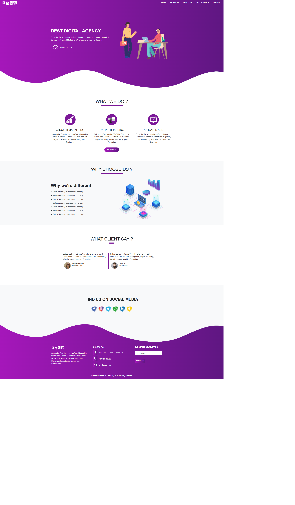

<!DOCTYPE html>
<html lang="tr">
<head>
<meta charset="UTF-8">

</head>

<body>

<h1 align="center">🚀 Digital Agency Bootstrap Template</h1>

Bootstrap 4 kullanılarak geliştirilmiş modern ve tamamen responsive
<strong>Dijital Ajans Landing Page</strong> projesidir.

<h2>📌 Proje Amacı</h2>

Bu proje; responsive tasarım geliştirme pratiği yapmak, Bootstrap grid sistemini
etkin şekilde kullanmak ve modern UI/UX prensiplerini uygulamak amacıyla hazırlanmıştır.

<ul>
<li>Responsive tasarım geliştirme</li>
<li>Bootstrap grid sistemi kullanımı</li>
<li>Modern gradient tabanlı arayüz tasarımı</li>
<li>Smooth scroll navigasyon entegrasyonu</li>
<li>Temiz ve sürdürülebilir CSS yapısı</li>
</ul>

<h2>🛠 Kullanılan Teknolojiler</h2>

<ul>
<li>HTML5 (Semantic yapı)</li>
<li>CSS3</li>
<li>Bootstrap 4</li>
<li>Font Awesome</li>
<li>Smooth Scroll v16.1.4</li>
<li>Responsive Design prensipleri</li>
</ul>

<h2>✨ Öne Çıkan Özellikler</h2>

<ul>
<li>Modern gradient navbar tasarımı</li>
<li>Responsive hero alanı</li>
<li>Hizmet kart yapısı (Services Section)</li>
<li>About bölümü</li>
<li>Testimonials (müşteri yorumları)</li>
<li>Sosyal medya ikon alanı</li>
<li>Footer iletişim bölümü</li>
<li>Smooth scroll animasyonu</li>
<li>Mobil uyumlu tasarım</li>
</ul>

<h2>📂 Proje Yapısı</h2>

<pre>
digital-agency-bootstrap-template/
│
├── index.html
├── style.css
├── smooth-scroll.js
├── README.html
├── digital.png
└── digital.gif
</pre>

<h2>📸 Proje Önizleme</h2>

<h2>🎥 Demo (GIF)</h2>

<h2>📦 Kullanılan Açık Kaynak Kütüphane</h2>

Bu projede aşağıdaki üçüncü parti açık kaynak kütüphane kullanılmaktadır:

<strong>Smooth Scroll v16.1.4</strong> 
Geliştirici: Chris Ferdinandi 
Lisans: MIT License 
Kaynak:
<a href="https://github.com/cferdinandi/smooth-scroll" target="_blank">
https://github.com/cferdinandi/smooth-scroll
</a>

<h2>🚀 Kurulum</h2>

Projeyi klonlayın:

<pre>
git clone https://github.com/kenansonmez1617-hub/digital-agency-bootstrap-template.git
</pre>

Ardından <strong>index.html</strong> dosyasını tarayıcıda açmanız yeterlidir.

<h2>👨‍💻 Geliştirici</h2>

<strong>Kenan Sönmez</strong> 
Frontend Developer

GitHub: 
<a href="https://github.com/kenansonmez1617-hub" target="_blank">
https://github.com/kenansonmez1617-hub
</a>

LinkedIn: 
<a href="https://www.linkedin.com/in/kenan-sonmez" target="_blank">
https://www.linkedin.com/in/kenan-sonmez
</a>

<h2>📄 Lisans</h2>

Bu proje eğitim ve portfolyo amaçlı geliştirilmiştir.
İncelenebilir ve geliştirilebilir.

⭐ Projeyi beğendiyseniz GitHub üzerinden yıldız bırakabilirsiniz.

</body>
</html>
